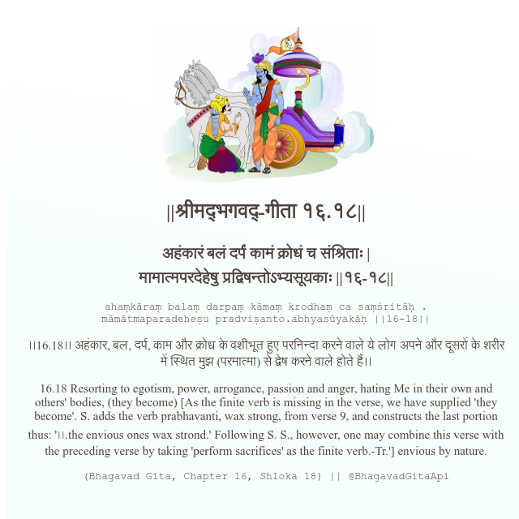

<h2>||श्रीमद्‍भगवद्‍-गीता १६.१८||</h2>
<h3>अहंकारं बलं दर्पं कामं क्रोधं च संश्रिताः | मामात्मपरदेहेषु प्रद्विषन्तोऽभ्यसूयकाः ||१६-१८||</h3>
<pre>ahaṃkāraṃ balaṃ darpaṃ kāmaṃ krodhaṃ ca saṃśritāḥ . māmātmaparadeheṣu pradviṣanto.abhyasūyakāḥ ||16-18||</pre>

।।16.18।। अहंकार, बल, दर्प, काम और क्रोध के वशीभूत हुए परनिन्दा करने वाले ये लोग अपने और दूसरों के शरीर में स्थित मुझ (परमात्मा) से द्वेष करने वाले होते हैं।।

<pre>(Bhagavad Gita, Chapter 16, Shloka 18) || @BhagavadGitaApi</pre>
https://bhagavadgitaapi.in/

#API #bhagavadgitaapi #slok #nodejs #js #api #gitaapi #krishna #hinduism #vedic #ISKCON #shreemadbhagavadgita #technology

