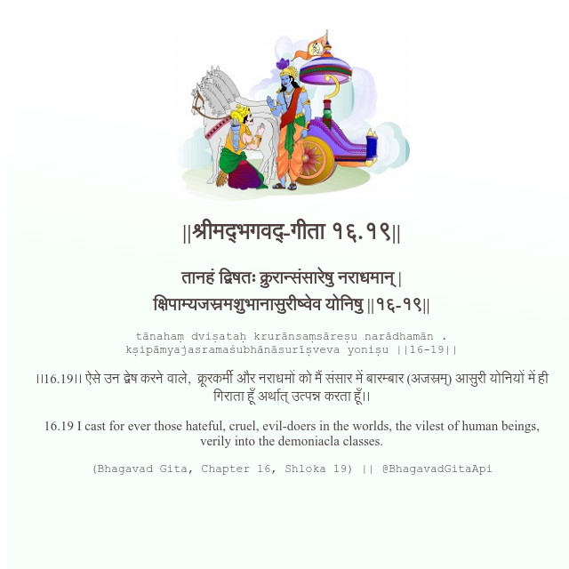

<h2>||श्रीमद्‍भगवद्‍-गीता १६.१९||</h2>
<h3>तानहं द्विषतः क्रुरान्संसारेषु नराधमान् | क्षिपाम्यजस्रमशुभानासुरीष्वेव योनिषु ||१६-१९||</h3>
<pre>tānahaṃ dviṣataḥ krurānsaṃsāreṣu narādhamān . kṣipāmyajasramaśubhānāsurīṣveva yoniṣu ||16-19||</pre>

।।16.19।। ऐसे उन द्वेष करने वाले,  क्रूरकर्मी और नराधमों को मैं संसार में बारम्बार (अजस्रम्) आसुरी योनियों में ही गिराता हूँ अर्थात् उत्पन्न करता हूँ।।

<pre>(Bhagavad Gita, Chapter 16, Shloka 19) || @BhagavadGitaApi</pre>
https://bhagavadgitaapi.in/

#API #bhagavadgitaapi #slok #nodejs #js #api #gitaapi #krishna #hinduism #vedic #ISKCON #shreemadbhagavadgita #technology

