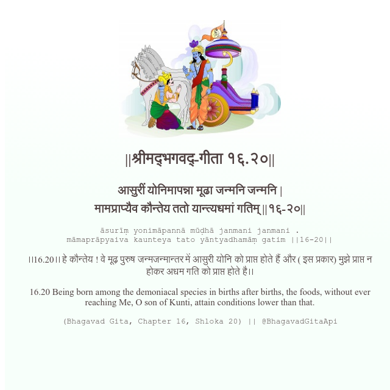

<h2>||श्रीमद्‍भगवद्‍-गीता १६.२०||</h2>
<h3>आसुरीं योनिमापन्ना मूढा जन्मनि जन्मनि | मामप्राप्यैव कौन्तेय ततो यान्त्यधमां गतिम् ||१६-२०||</h3>
<pre>āsurīṃ yonimāpannā mūḍhā janmani janmani . māmaprāpyaiva kaunteya tato yāntyadhamāṃ gatim ||16-20||</pre>

।।16.20।। हे कौन्तेय ! वे मूढ़ पुरुष जन्मजन्मान्तर में आसुरी योनि को प्राप्त होते हैं और ( इस प्रकार) मुझे प्राप्त न होकर अधम गति को प्राप्त होते है।।

<pre>(Bhagavad Gita, Chapter 16, Shloka 20) || @BhagavadGitaApi</pre>
https://docs.bhagavadgitaapi.in/

#API #bhagavadgitaapi #slok #nodejs #js #api #gitaapi #krishna #hinduism #vedic #ISKCON #shreemadbhagavadgita #technology

