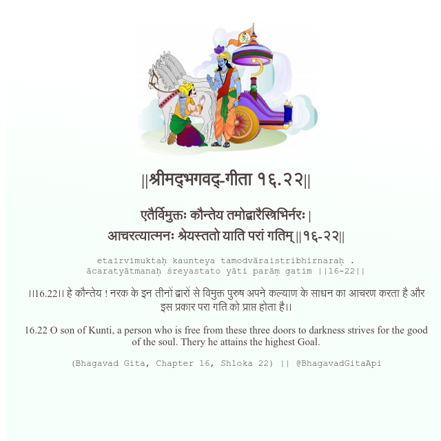

<h2>||श्रीमद्‍भगवद्‍-गीता १६.२२||</h2>
<h3>एतैर्विमुक्तः कौन्तेय तमोद्वारैस्त्रिभिर्नरः | आचरत्यात्मनः श्रेयस्ततो याति परां गतिम् ||१६-२२||</h3>
<pre>etairvimuktaḥ kaunteya tamodvāraistribhirnaraḥ . ācaratyātmanaḥ śreyastato yāti parāṃ gatim ||16-22||</pre>

।।16.22।। हे कौन्तेय ! नरक के इन तीनों द्वारों से विमुक्त पुरुष अपने कल्याण के साधन का आचरण करता है और इस प्रकार परा गति को प्राप्त होता है।।

<pre>(Bhagavad Gita, Chapter 16, Shloka 22) || @BhagavadGitaApi</pre>
https://vedicscriptures.github.io/

#API #bhagavadgitaapi #slok #nodejs #js #api #gitaapi #krishna #hinduism #vedic #ISKCON #shreemadbhagavadgita #technology

