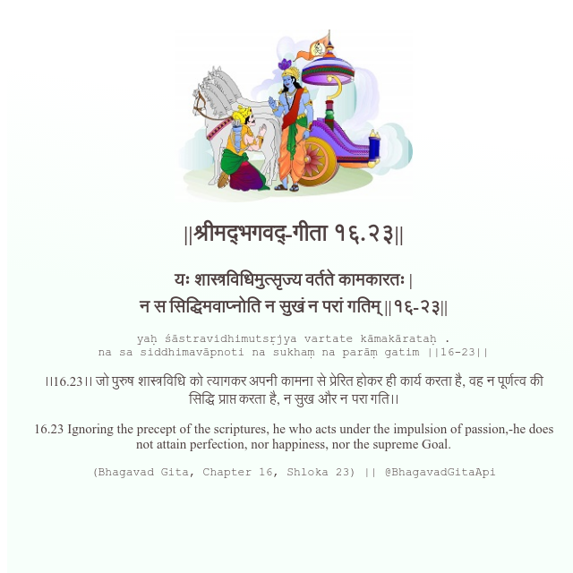

<h2>||श्रीमद्‍भगवद्‍-गीता १६.२३||</h2>
<h3>यः शास्त्रविधिमुत्सृज्य वर्तते कामकारतः | न स सिद्धिमवाप्नोति न सुखं न परां गतिम् ||१६-२३||</h3>
<pre>yaḥ śāstravidhimutsṛjya vartate kāmakārataḥ . na sa siddhimavāpnoti na sukhaṃ na parāṃ gatim ||16-23||</pre>

।।16.23।। जो पुरुष शास्त्रविधि को त्यागकर अपनी कामना से प्रेरित होकर ही कार्य करता है, वह न पूर्णत्व की सिद्धि प्राप्त करता है, न सुख और न परा गति।।

<pre>(Bhagavad Gita, Chapter 16, Shloka 23) || @BhagavadGitaApi</pre>
https://vedicscriptures.github.io/

#API #bhagavadgitaapi #slok #nodejs #js #api #gitaapi #krishna #hinduism #vedic #ISKCON #shreemadbhagavadgita #technology

