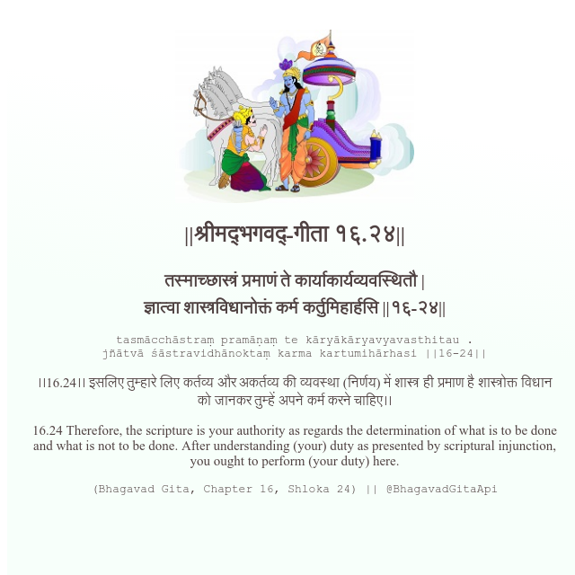

<h2>||श्रीमद्‍भगवद्‍-गीता १६.२४||</h2>
<h3>तस्माच्छास्त्रं प्रमाणं ते कार्याकार्यव्यवस्थितौ | ज्ञात्वा शास्त्रविधानोक्तं कर्म कर्तुमिहार्हसि ||१६-२४||</h3>
<pre>tasmācchāstraṃ pramāṇaṃ te kāryākāryavyavasthitau . jñātvā śāstravidhānoktaṃ karma kartumihārhasi ||16-24||</pre>

।।16.24।। इसलिए तुम्हारे लिए कर्तव्य और अकर्तव्य की व्यवस्था (निर्णय) में शास्त्र ही प्रमाण है शास्त्रोक्त विधान को जानकर तुम्हें अपने कर्म करने चाहिए।।

<pre>(Bhagavad Gita, Chapter 16, Shloka 24) || @BhagavadGitaApi</pre>
https://bhagavadgitaapi.in/

#API #bhagavadgitaapi #slok #nodejs #js #api #gitaapi #krishna #hinduism #vedic #ISKCON #shreemadbhagavadgita #technology

