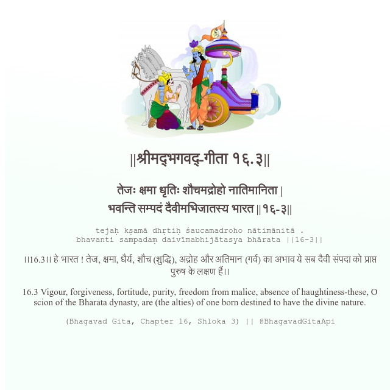

<h2>||श्रीमद्‍भगवद्‍-गीता १६.३||</h2>
<h3>तेजः क्षमा धृतिः शौचमद्रोहो नातिमानिता | भवन्ति सम्पदं दैवीमभिजातस्य भारत ||१६-३||</h3>
<pre>tejaḥ kṣamā dhṛtiḥ śaucamadroho nātimānitā . bhavanti sampadaṃ daivīmabhijātasya bhārata ||16-3||</pre>

।।16.3।। हे भारत ! तेज, क्षमा, धैर्य, शौच (शुद्धि), अद्रोह और अतिमान (गर्व) का अभाव ये सब दैवी संपदा को प्राप्त पुरुष के लक्षण हैं।।

<pre>(Bhagavad Gita, Chapter 16, Shloka 3) || @BhagavadGitaApi</pre>
https://vedicscriptures.github.io/

#API #bhagavadgitaapi #slok #nodejs #js #api #gitaapi #krishna #hinduism #vedic #ISKCON #shreemadbhagavadgita #technology

