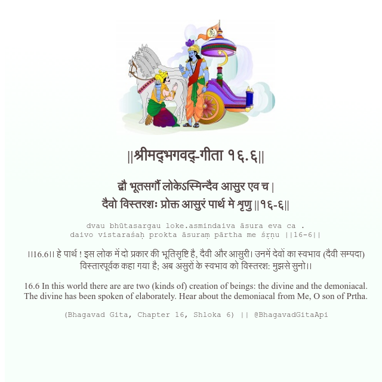

<h2>||श्रीमद्‍भगवद्‍-गीता १६.६||</h2>
<h3>द्वौ भूतसर्गौ लोकेऽस्मिन्दैव आसुर एव च | दैवो विस्तरशः प्रोक्त आसुरं पार्थ मे शृणु ||१६-६||</h3>
<pre>dvau bhūtasargau loke.asmindaiva āsura eva ca . daivo vistaraśaḥ prokta āsuraṃ pārtha me śṛṇu ||16-6||</pre>

।।16.6।। हे पार्थ ! इस लोक में दो प्रकार की भूतिसृष्टि है, दैवी और आसुरी। उनमें देवों का स्वभाव (दैवी सम्पदा) विस्तारपूर्वक कहा गया है; अब असुरों के स्वभाव को विस्तरश: मुझसे सुनो।।

<pre>(Bhagavad Gita, Chapter 16, Shloka 6) || @BhagavadGitaApi</pre>
https://bhagavadgitaapi.in/

#API #bhagavadgitaapi #slok #nodejs #js #api #gitaapi #krishna #hinduism #vedic #ISKCON #shreemadbhagavadgita #technology

