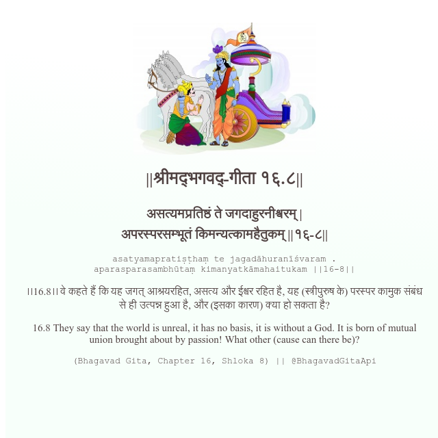

<h2>||श्रीमद्‍भगवद्‍-गीता १६.८||</h2>
<h3>असत्यमप्रतिष्ठं ते जगदाहुरनीश्वरम् | अपरस्परसम्भूतं किमन्यत्कामहैतुकम् ||१६-८||</h3>
<pre>asatyamapratiṣṭhaṃ te jagadāhuranīśvaram . aparasparasambhūtaṃ kimanyatkāmahaitukam ||16-8||</pre>

।।16.8।। वे कहते हैं कि यह जगत् आश्रयरहित, असत्य और ईश्वर रहित है, यह (स्त्रीपुरुष के) परस्पर कामुक संबंध से ही उत्पन्न हुआ है, और (इसका कारण) क्या हो सकता है?

<pre>(Bhagavad Gita, Chapter 16, Shloka 8) || @BhagavadGitaApi</pre>
https://vedicscriptures.github.io/

#API #bhagavadgitaapi #slok #nodejs #js #api #gitaapi #krishna #hinduism #vedic #ISKCON #shreemadbhagavadgita #technology

