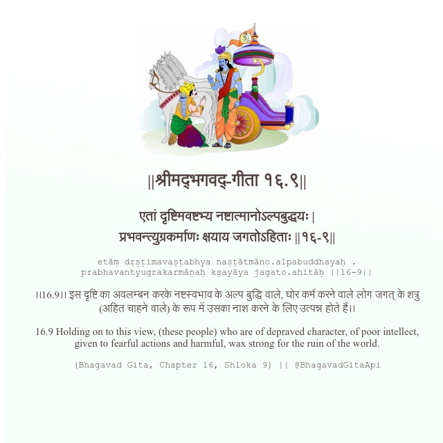

<h2>||श्रीमद्‍भगवद्‍-गीता १६.९||</h2>
<h3>एतां दृष्टिमवष्टभ्य नष्टात्मानोऽल्पबुद्धयः | प्रभवन्त्युग्रकर्माणः क्षयाय जगतोऽहिताः ||१६-९||</h3>
<pre>etāṃ dṛṣṭimavaṣṭabhya naṣṭātmāno.alpabuddhayaḥ . prabhavantyugrakarmāṇaḥ kṣayāya jagato.ahitāḥ ||16-9||</pre>

।।16.9।। इस दृष्टि का अवलम्बन करके नष्टस्वभाव के अल्प बुद्धि वाले, घोर कर्म करने वाले लोग जगत् के शत्रु (अहित चाहने वाले) के रूप में उसका नाश करने के लिए उत्पन्न होते हैं।।

<pre>(Bhagavad Gita, Chapter 16, Shloka 9) || @BhagavadGitaApi</pre>
https://bhagavadgitaapi.in/

#API #bhagavadgitaapi #slok #nodejs #js #api #gitaapi #krishna #hinduism #vedic #ISKCON #shreemadbhagavadgita #technology

