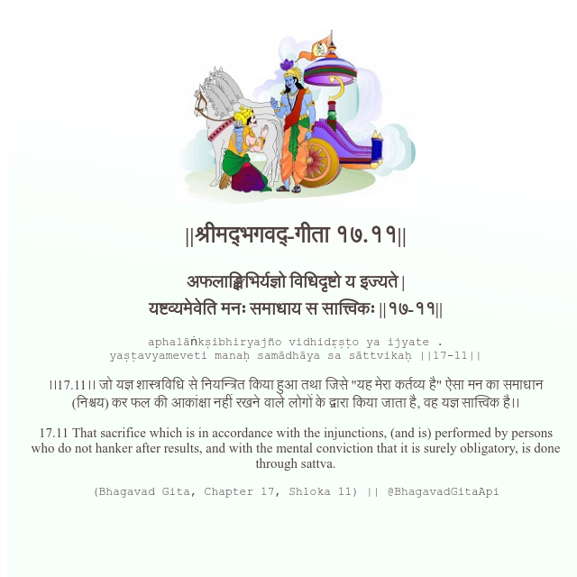

<h2>||श्रीमद्‍भगवद्‍-गीता १७.११||</h2>
<h3>अफलाङ्क्षिभिर्यज्ञो विधिदृष्टो य इज्यते | यष्टव्यमेवेति मनः समाधाय स सात्त्विकः ||१७-११||</h3>
<pre>aphalāṅkṣibhiryajño vidhidṛṣṭo ya ijyate . yaṣṭavyameveti manaḥ samādhāya sa sāttvikaḥ ||17-11||</pre>

।।17.11।। जो यज्ञ शास्त्रविधि से नियन्त्रित किया हुआ तथा जिसे "यह मेरा कर्तव्य है" ऐसा मन का समाधान (निश्चय) कर फल की आकांक्षा नहीं रखने वाले लोगों के द्वारा किया जाता है, वह यज्ञ सात्त्विक है।।

<pre>(Bhagavad Gita, Chapter 17, Shloka 11) || @BhagavadGitaApi</pre>
https://bhagavadgitaapi.in/

#API #bhagavadgitaapi #slok #nodejs #js #api #gitaapi #krishna #hinduism #vedic #ISKCON #shreemadbhagavadgita #technology

