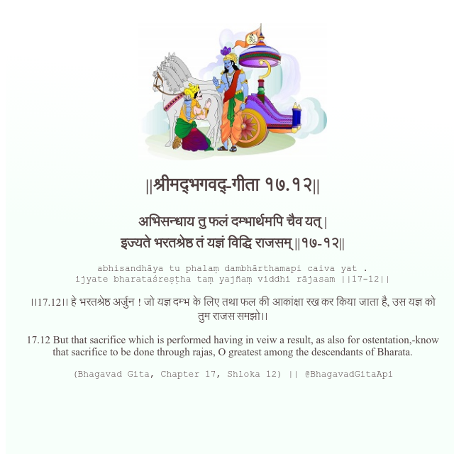

<h2>||श्रीमद्‍भगवद्‍-गीता १७.१२||</h2>
<h3>अभिसन्धाय तु फलं दम्भार्थमपि चैव यत् | इज्यते भरतश्रेष्ठ तं यज्ञं विद्धि राजसम् ||१७-१२||</h3>
<pre>abhisandhāya tu phalaṃ dambhārthamapi caiva yat . ijyate bharataśreṣṭha taṃ yajñaṃ viddhi rājasam ||17-12||</pre>

।।17.12।। हे भरतश्रेष्ठ अर्जुन ! जो यज्ञ दम्भ के लिए तथा फल की आकांक्षा रख कर किया जाता है, उस यज्ञ को तुम राजस समझो।।

<pre>(Bhagavad Gita, Chapter 17, Shloka 12) || @BhagavadGitaApi</pre>
https://docs.bhagavadgitaapi.in/

#API #bhagavadgitaapi #slok #nodejs #js #api #gitaapi #krishna #hinduism #vedic #ISKCON #shreemadbhagavadgita #technology

