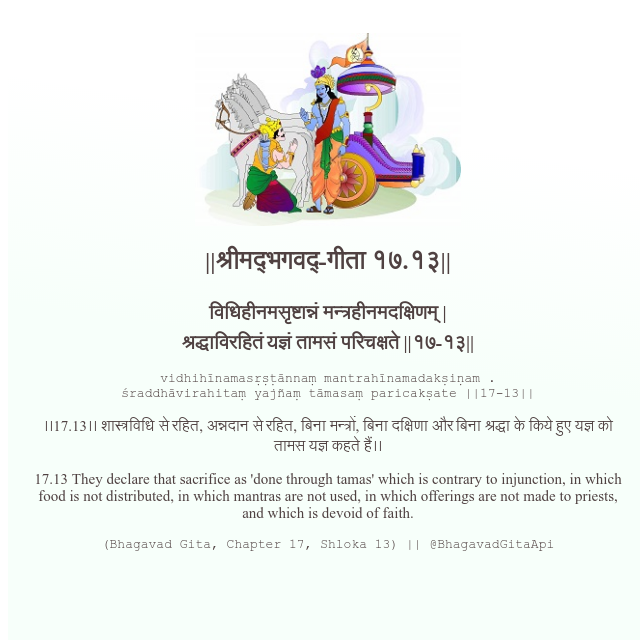

<h2>||श्रीमद्‍भगवद्‍-गीता १७.१३||</h2>
<h3>विधिहीनमसृष्टान्नं मन्त्रहीनमदक्षिणम् | श्रद्धाविरहितं यज्ञं तामसं परिचक्षते ||१७-१३||</h3>
<pre>vidhihīnamasṛṣṭānnaṃ mantrahīnamadakṣiṇam . śraddhāvirahitaṃ yajñaṃ tāmasaṃ paricakṣate ||17-13||</pre>

।।17.13।। शास्त्रविधि से रहित, अन्नदान से रहित, बिना मन्त्रों, बिना दक्षिणा और बिना श्रद्धा के किये हुए यज्ञ को तामस यज्ञ कहते हैं।।

<pre>(Bhagavad Gita, Chapter 17, Shloka 13) || @BhagavadGitaApi</pre>
https://vedicscriptures.github.io/

#API #bhagavadgitaapi #slok #nodejs #js #api #gitaapi #krishna #hinduism #vedic #ISKCON #shreemadbhagavadgita #technology

