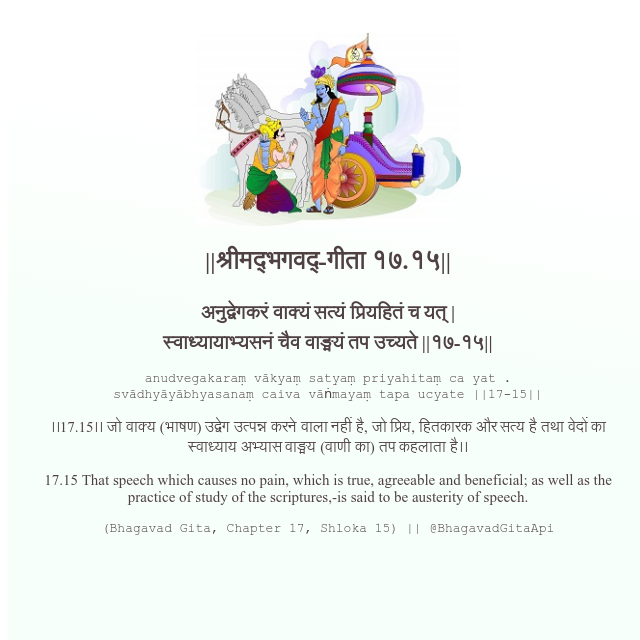

<h2>||श्रीमद्‍भगवद्‍-गीता १७.१५||</h2>
<h3>अनुद्वेगकरं वाक्यं सत्यं प्रियहितं च यत् | स्वाध्यायाभ्यसनं चैव वाङ्मयं तप उच्यते ||१७-१५||</h3>
<pre>anudvegakaraṃ vākyaṃ satyaṃ priyahitaṃ ca yat . svādhyāyābhyasanaṃ caiva vāṅmayaṃ tapa ucyate ||17-15||</pre>

।।17.15।। जो वाक्य (भाषण) उद्वेग उत्पन्न करने वाला नहीं है, जो प्रिय, हितकारक और सत्य है तथा वेदों का स्वाध्याय अभ्यास वाङ्मय (वाणी का) तप कहलाता है।।

<pre>(Bhagavad Gita, Chapter 17, Shloka 15) || @BhagavadGitaApi</pre>
https://docs.bhagavadgitaapi.in/

#API #bhagavadgitaapi #slok #nodejs #js #api #gitaapi #krishna #hinduism #vedic #ISKCON #shreemadbhagavadgita #technology

