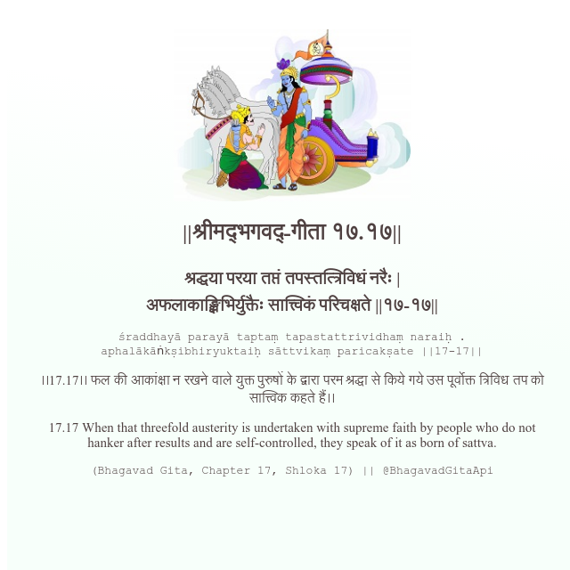

<h2>||श्रीमद्‍भगवद्‍-गीता १७.१७||</h2>
<h3>श्रद्धया परया तप्तं तपस्तत्त्रिविधं नरैः | अफलाकाङ्क्षिभिर्युक्तैः सात्त्विकं परिचक्षते ||१७-१७||</h3>
<pre>śraddhayā parayā taptaṃ tapastattrividhaṃ naraiḥ . aphalākāṅkṣibhiryuktaiḥ sāttvikaṃ paricakṣate ||17-17||</pre>

।।17.17।। फल की आकांक्षा न रखने वाले युक्त पुरुषों के द्वारा परम श्रद्धा से किये गये उस पूर्वोक्त त्रिविध तप को सात्त्विक कहते हैं।।

<pre>(Bhagavad Gita, Chapter 17, Shloka 17) || @BhagavadGitaApi</pre>
https://docs.bhagavadgitaapi.in/

#API #bhagavadgitaapi #slok #nodejs #js #api #gitaapi #krishna #hinduism #vedic #ISKCON #shreemadbhagavadgita #technology

