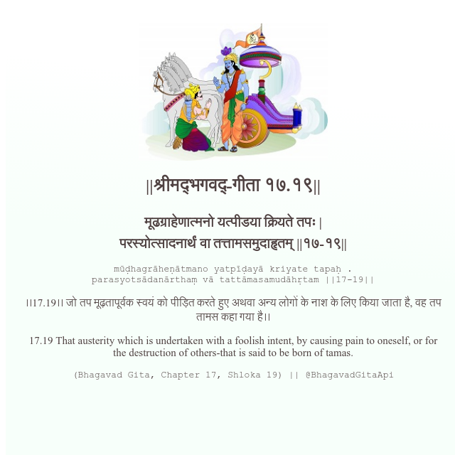

<h2>||श्रीमद्‍भगवद्‍-गीता १७.१९||</h2>
<h3>मूढग्राहेणात्मनो यत्पीडया क्रियते तपः | परस्योत्सादनार्थं वा तत्तामसमुदाहृतम् ||१७-१९||</h3>
<pre>mūḍhagrāheṇātmano yatpīḍayā kriyate tapaḥ . parasyotsādanārthaṃ vā tattāmasamudāhṛtam ||17-19||</pre>

।।17.19।। जो तप मूढ़तापूर्वक स्वयं को पीड़ित करते हुए अथवा अन्य लोगों के नाश के लिए किया जाता है, वह तप तामस कहा गया है।।

<pre>(Bhagavad Gita, Chapter 17, Shloka 19) || @BhagavadGitaApi</pre>
https://vedicscriptures.github.io/

#API #bhagavadgitaapi #slok #nodejs #js #api #gitaapi #krishna #hinduism #vedic #ISKCON #shreemadbhagavadgita #technology

