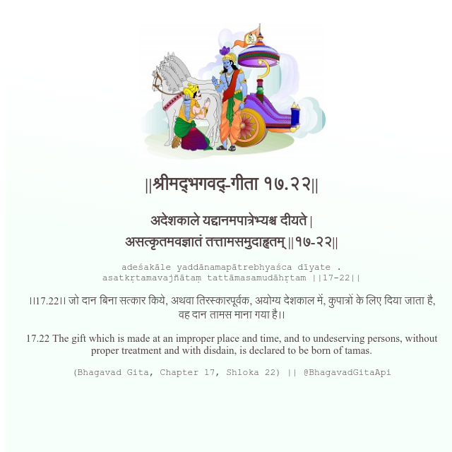

<h2>||श्रीमद्‍भगवद्‍-गीता १७.२२||</h2>
<h3>अदेशकाले यद्दानमपात्रेभ्यश्च दीयते | असत्कृतमवज्ञातं तत्तामसमुदाहृतम् ||१७-२२||</h3>
<pre>adeśakāle yaddānamapātrebhyaśca dīyate . asatkṛtamavajñātaṃ tattāmasamudāhṛtam ||17-22||</pre>

।।17.22।। जो दान बिना सत्कार किये, अथवा तिरस्कारपूर्वक, अयोग्य देशकाल में, कुपात्रों के लिए दिया जाता है, वह दान तामस माना गया है।।

<pre>(Bhagavad Gita, Chapter 17, Shloka 22) || @BhagavadGitaApi</pre>
https://vedicscriptures.github.io/

#API #bhagavadgitaapi #slok #nodejs #js #api #gitaapi #krishna #hinduism #vedic #ISKCON #shreemadbhagavadgita #technology

