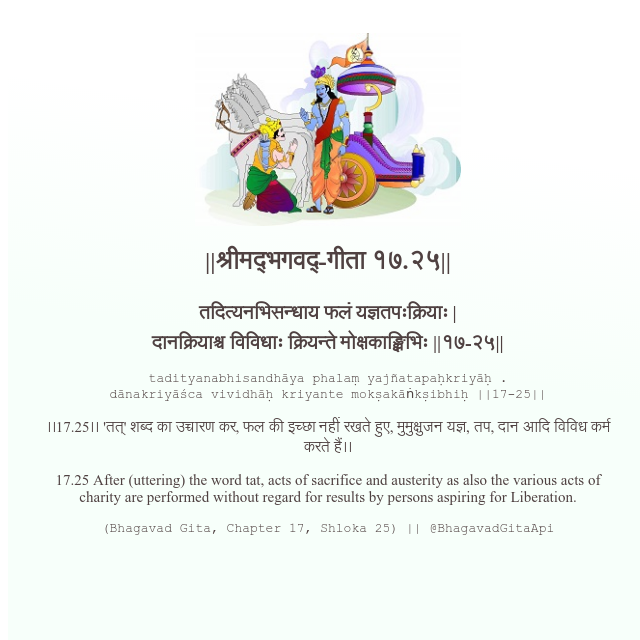

<h2>||श्रीमद्‍भगवद्‍-गीता १७.२५||</h2>
<h3>तदित्यनभिसन्धाय फलं यज्ञतपःक्रियाः | दानक्रियाश्च विविधाः क्रियन्ते मोक्षकाङ्क्षिभिः ||१७-२५||</h3>
<pre>tadityanabhisandhāya phalaṃ yajñatapaḥkriyāḥ . dānakriyāśca vividhāḥ kriyante mokṣakāṅkṣibhiḥ ||17-25||</pre>

।।17.25।। 'तत्' शब्द का उच्चारण कर, फल की इच्छा नहीं रखते हुए, मुमुक्षुजन यज्ञ, तप, दान आदि विविध कर्म करते हैं।।

<pre>(Bhagavad Gita, Chapter 17, Shloka 25) || @BhagavadGitaApi</pre>
https://docs.bhagavadgitaapi.in/

#API #bhagavadgitaapi #slok #nodejs #js #api #gitaapi #krishna #hinduism #vedic #ISKCON #shreemadbhagavadgita #technology

