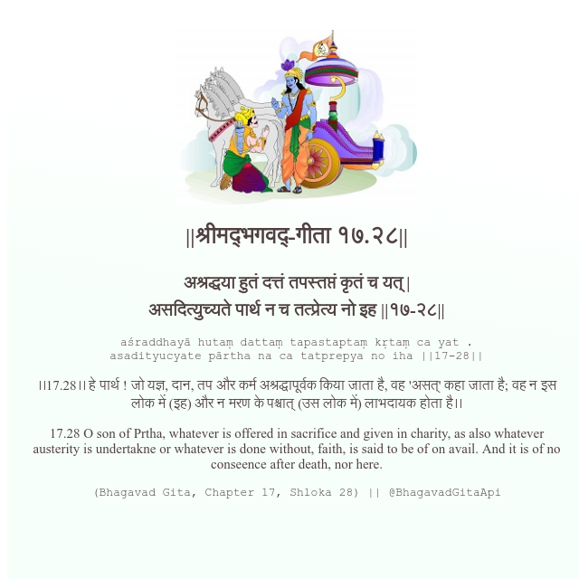

<h2>||श्रीमद्‍भगवद्‍-गीता १७.२८||</h2>
<h3>अश्रद्धया हुतं दत्तं तपस्तप्तं कृतं च यत् | असदित्युच्यते पार्थ न च तत्प्रेत्य नो इह ||१७-२८||</h3>
<pre>aśraddhayā hutaṃ dattaṃ tapastaptaṃ kṛtaṃ ca yat . asadityucyate pārtha na ca tatprepya no iha ||17-28||</pre>

।।17.28।। हे पार्थ ! जो यज्ञ, दान, तप और कर्म अश्रद्धापूर्वक किया जाता है, वह 'असत्' कहा जाता है; वह न इस लोक में (इह) और न मरण के पश्चात् (उस लोक में) लाभदायक होता है।।

<pre>(Bhagavad Gita, Chapter 17, Shloka 28) || @BhagavadGitaApi</pre>
https://docs.bhagavadgitaapi.in/

#API #bhagavadgitaapi #slok #nodejs #js #api #gitaapi #krishna #hinduism #vedic #ISKCON #shreemadbhagavadgita #technology

