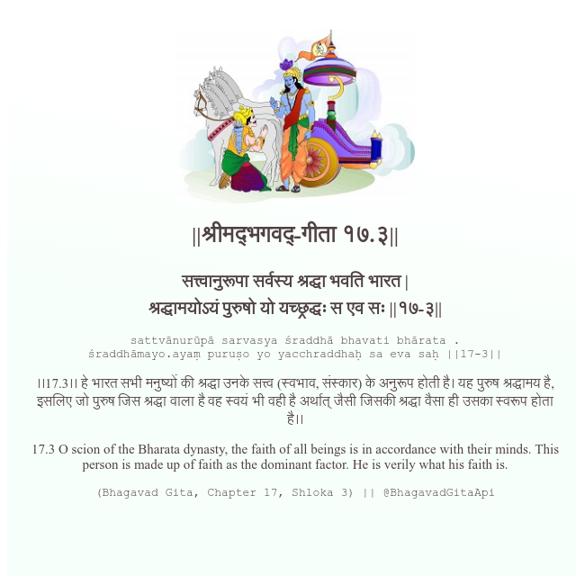

<h2>||श्रीमद्‍भगवद्‍-गीता १७.३||</h2>
<h3>सत्त्वानुरूपा सर्वस्य श्रद्धा भवति भारत | श्रद्धामयोऽयं पुरुषो यो यच्छ्रद्धः स एव सः ||१७-३||</h3>
<pre>sattvānurūpā sarvasya śraddhā bhavati bhārata . śraddhāmayo.ayaṃ puruṣo yo yacchraddhaḥ sa eva saḥ ||17-3||</pre>

।।17.3।। हे भारत सभी मनुष्यों की श्रद्धा उनके सत्त्व (स्वभाव, संस्कार) के अनुरूप होती है। यह पुरुष श्रद्धामय है, इसलिए जो पुरुष जिस श्रद्धा वाला है वह स्वयं भी वही है अर्थात् जैसी जिसकी श्रद्धा वैसा ही उसका स्वरूप होता है।।

<pre>(Bhagavad Gita, Chapter 17, Shloka 3) || @BhagavadGitaApi</pre>
https://bhagavadgitaapi.in/

#API #bhagavadgitaapi #slok #nodejs #js #api #gitaapi #krishna #hinduism #vedic #ISKCON #shreemadbhagavadgita #technology

