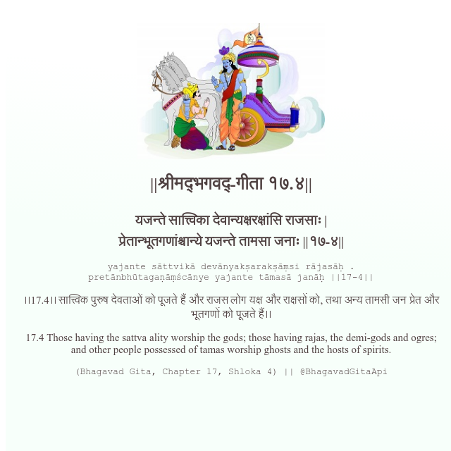

<h2>||श्रीमद्‍भगवद्‍-गीता १७.४||</h2>
<h3>यजन्ते सात्त्विका देवान्यक्षरक्षांसि राजसाः | प्रेतान्भूतगणांश्चान्ये यजन्ते तामसा जनाः ||१७-४||</h3>
<pre>yajante sāttvikā devānyakṣarakṣāṃsi rājasāḥ . pretānbhūtagaṇāṃścānye yajante tāmasā janāḥ ||17-4||</pre>

।।17.4।। सात्त्विक पुरुष देवताओं को पूजते हैं और राजस लोग यक्ष और राक्षसों को, तथा अन्य तामसी जन प्रेत और भूतगणों को पूजते हैं।।

<pre>(Bhagavad Gita, Chapter 17, Shloka 4) || @BhagavadGitaApi</pre>
https://docs.bhagavadgitaapi.in/

#API #bhagavadgitaapi #slok #nodejs #js #api #gitaapi #krishna #hinduism #vedic #ISKCON #shreemadbhagavadgita #technology

