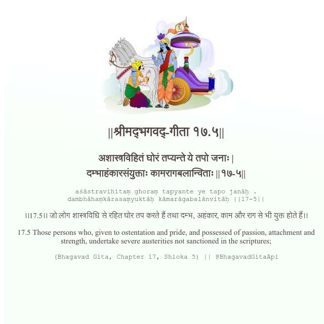

<h2>||श्रीमद्‍भगवद्‍-गीता १७.५||</h2>
<h3>अशास्त्रविहितं घोरं तप्यन्ते ये तपो जनाः | दम्भाहंकारसंयुक्ताः कामरागबलान्विताः ||१७-५||</h3>
<pre>aśāstravihitaṃ ghoraṃ tapyante ye tapo janāḥ . dambhāhaṃkārasaṃyuktāḥ kāmarāgabalānvitāḥ ||17-5||</pre>

।।17.5।। जो लोग शास्त्रविधि से रहित घोर तप करते हैं तथा दम्भ, अहंकार, काम और राग से भी युक्त होते हैं।।

<pre>(Bhagavad Gita, Chapter 17, Shloka 5) || @BhagavadGitaApi</pre>
https://bhagavadgitaapi.in/

#API #bhagavadgitaapi #slok #nodejs #js #api #gitaapi #krishna #hinduism #vedic #ISKCON #shreemadbhagavadgita #technology

