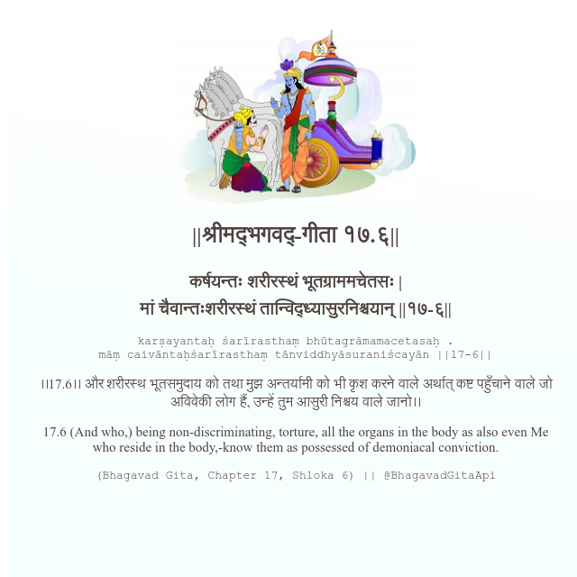

<h2>||श्रीमद्‍भगवद्‍-गीता १७.६||</h2>
<h3>कर्षयन्तः शरीरस्थं भूतग्राममचेतसः | मां चैवान्तःशरीरस्थं तान्विद्ध्यासुरनिश्चयान् ||१७-६||</h3>
<pre>karṣayantaḥ śarīrasthaṃ bhūtagrāmamacetasaḥ . māṃ caivāntaḥśarīrasthaṃ tānviddhyāsuraniścayān ||17-6||</pre>

।।17.6।। और शरीरस्थ भूतसमुदाय को तथा मुझ अन्तर्यामी को भी कृश करने वाले अर्थात् कष्ट पहुँचाने वाले जो अविवेकी लोग हैं, उन्हें तुम आसुरी निश्चय वाले जानो।।

<pre>(Bhagavad Gita, Chapter 17, Shloka 6) || @BhagavadGitaApi</pre>
https://vedicscriptures.github.io/

#API #bhagavadgitaapi #slok #nodejs #js #api #gitaapi #krishna #hinduism #vedic #ISKCON #shreemadbhagavadgita #technology

