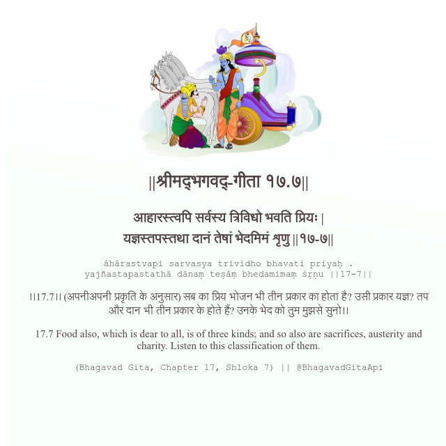

<h2>||श्रीमद्‍भगवद्‍-गीता १७.७||</h2>
<h3>आहारस्त्वपि सर्वस्य त्रिविधो भवति प्रियः | यज्ञस्तपस्तथा दानं तेषां भेदमिमं शृणु ||१७-७||</h3>
<pre>āhārastvapi sarvasya trividho bhavati priyaḥ . yajñastapastathā dānaṃ teṣāṃ bhedamimaṃ śṛṇu ||17-7||</pre>

।।17.7।। (अपनीअपनी प्रकृति के अनुसार) सब का प्रिय भोजन भी तीन प्रकार का होता है? उसी प्रकार यज्ञ? तप और दान भी तीन प्रकार के होते हैं? उनके भेद को तुम मुझसे सुनो।।

<pre>(Bhagavad Gita, Chapter 17, Shloka 7) || @BhagavadGitaApi</pre>
https://bhagavadgitaapi.in/

#API #bhagavadgitaapi #slok #nodejs #js #api #gitaapi #krishna #hinduism #vedic #ISKCON #shreemadbhagavadgita #technology

