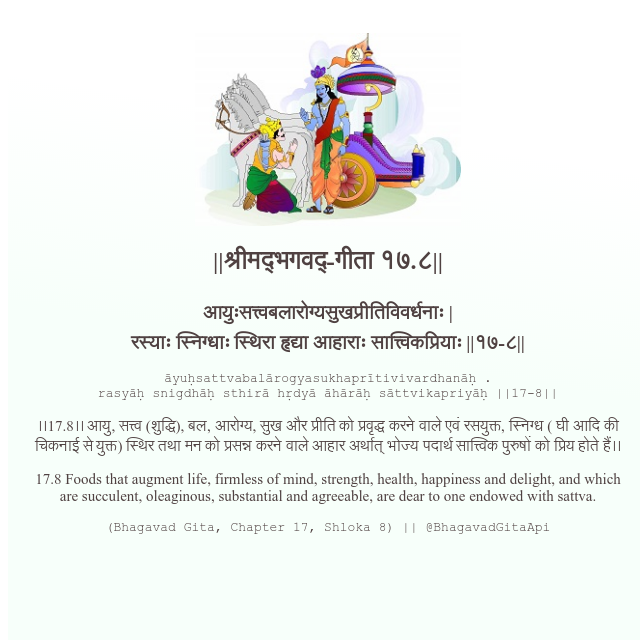

<h2>||श्रीमद्‍भगवद्‍-गीता १७.८||</h2>
<h3>आयुःसत्त्वबलारोग्यसुखप्रीतिविवर्धनाः | रस्याः स्निग्धाः स्थिरा हृद्या आहाराः सात्त्विकप्रियाः ||१७-८||</h3>
<pre>āyuḥsattvabalārogyasukhaprītivivardhanāḥ . rasyāḥ snigdhāḥ sthirā hṛdyā āhārāḥ sāttvikapriyāḥ ||17-8||</pre>

।।17.8।। आयु, सत्त्व (शुद्धि), बल, आरोग्य, सुख और प्रीति को प्रवृद्ध करने वाले एवं रसयुक्त, स्निग्ध ( घी आदि की चिकनाई से युक्त) स्थिर तथा मन को प्रसन्न करने वाले आहार अर्थात् भोज्य पदार्थ सात्त्विक पुरुषों को प्रिय होते हैं।।

<pre>(Bhagavad Gita, Chapter 17, Shloka 8) || @BhagavadGitaApi</pre>
https://vedicscriptures.github.io/

#API #bhagavadgitaapi #slok #nodejs #js #api #gitaapi #krishna #hinduism #vedic #ISKCON #shreemadbhagavadgita #technology

