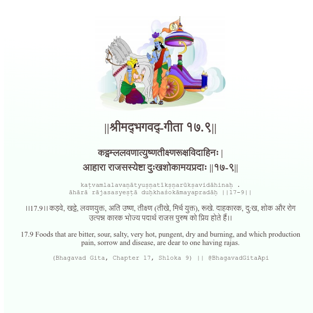

<h2>||श्रीमद्‍भगवद्‍-गीता १७.९||</h2>
<h3>कट्वम्ललवणात्युष्णतीक्ष्णरूक्षविदाहिनः | आहारा राजसस्येष्टा दुःखशोकामयप्रदाः ||१७-९||</h3>
<pre>kaṭvamlalavaṇātyuṣṇatīkṣṇarūkṣavidāhinaḥ . āhārā rājasasyeṣṭā duḥkhaśokāmayapradāḥ ||17-9||</pre>

।।17.9।। कड़वे, खट्टे, लवणयुक्त, अति उष्ण, तीक्ष्ण (तीखे, मिर्च युक्त), रूखे. दाहकारक, दु:ख, शोक और रोग उत्पन्न कारक भोज्य पदार्थ राजस पुरुष को प्रिय होते हैं।।

<pre>(Bhagavad Gita, Chapter 17, Shloka 9) || @BhagavadGitaApi</pre>
https://docs.bhagavadgitaapi.in/

#API #bhagavadgitaapi #slok #nodejs #js #api #gitaapi #krishna #hinduism #vedic #ISKCON #shreemadbhagavadgita #technology

