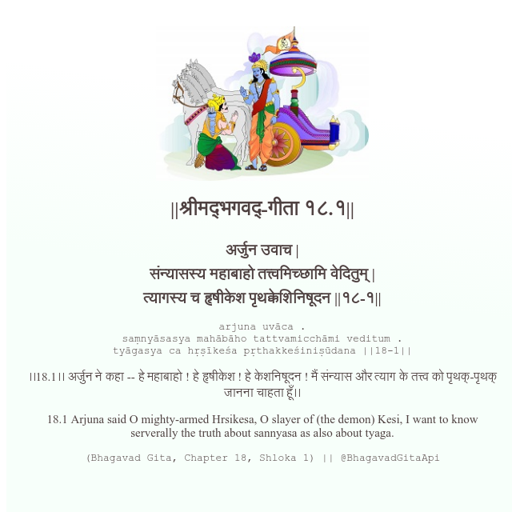

<h2>||श्रीमद्‍भगवद्‍-गीता १८.१||</h2>
<h3>अर्जुन उवाच | संन्यासस्य महाबाहो तत्त्वमिच्छामि वेदितुम् | त्यागस्य च हृषीकेश पृथक्केशिनिषूदन ||१८-१||</h3>
<pre>arjuna uvāca . saṃnyāsasya mahābāho tattvamicchāmi veditum . tyāgasya ca hṛṣīkeśa pṛthakkeśiniṣūdana ||18-1||</pre>

।।18.1।। अर्जुन ने कहा -- हे महाबाहो ! हे हृषीकेश ! हे केशनिषूदन ! मैं संन्यास और त्याग के तत्त्व को पृथक्-पृथक् जानना चाहता हूँ।।

<pre>(Bhagavad Gita, Chapter 18, Shloka 1) || @BhagavadGitaApi</pre>
https://bhagavadgitaapi.in/

#API #bhagavadgitaapi #slok #nodejs #js #api #gitaapi #krishna #hinduism #vedic #ISKCON #shreemadbhagavadgita #technology

