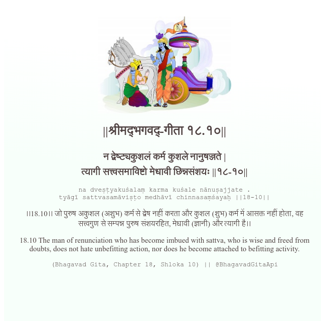

<h2>||श्रीमद्‍भगवद्‍-गीता १८.१०||</h2>
<h3>न द्वेष्ट्यकुशलं कर्म कुशले नानुषज्जते | त्यागी सत्त्वसमाविष्टो मेधावी छिन्नसंशयः ||१८-१०||</h3>
<pre>na dveṣṭyakuśalaṃ karma kuśale nānuṣajjate . tyāgī sattvasamāviṣṭo medhāvī chinnasaṃśayaḥ ||18-10||</pre>

।।18.10।। जो पुरुष अकुशल (अशुभ) कर्म से द्वेष नहीं करता और कुशल (शुभ) कर्म में आसक्त नहीं होता, वह सत्त्वगुण से सम्पन्न पुरुष संशयरहित, मेधावी (ज्ञानी) और त्यागी है।।

<pre>(Bhagavad Gita, Chapter 18, Shloka 10) || @BhagavadGitaApi</pre>
https://docs.bhagavadgitaapi.in/

#API #bhagavadgitaapi #slok #nodejs #js #api #gitaapi #krishna #hinduism #vedic #ISKCON #shreemadbhagavadgita #technology

