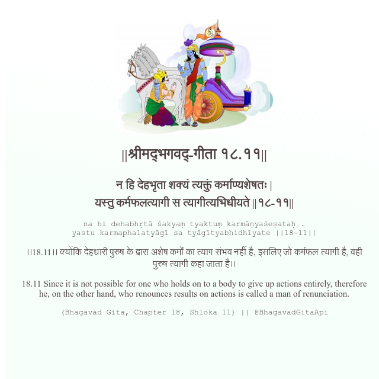

<h2>||श्रीमद्‍भगवद्‍-गीता १८.११||</h2>
<h3>न हि देहभृता शक्यं त्यक्तुं कर्माण्यशेषतः | यस्तु कर्मफलत्यागी स त्यागीत्यभिधीयते ||१८-११||</h3>
<pre>na hi dehabhṛtā śakyaṃ tyaktuṃ karmāṇyaśeṣataḥ . yastu karmaphalatyāgī sa tyāgītyabhidhīyate ||18-11||</pre>

।।18.11।। क्योंकि देहधारी पुरुष के द्वारा अशेष कर्मों का त्याग संभव नहीं है, इसलिए जो कर्मफल त्यागी है, वही पुरुष त्यागी कहा जाता है।।

<pre>(Bhagavad Gita, Chapter 18, Shloka 11) || @BhagavadGitaApi</pre>
https://vedicscriptures.github.io/

#API #bhagavadgitaapi #slok #nodejs #js #api #gitaapi #krishna #hinduism #vedic #ISKCON #shreemadbhagavadgita #technology

