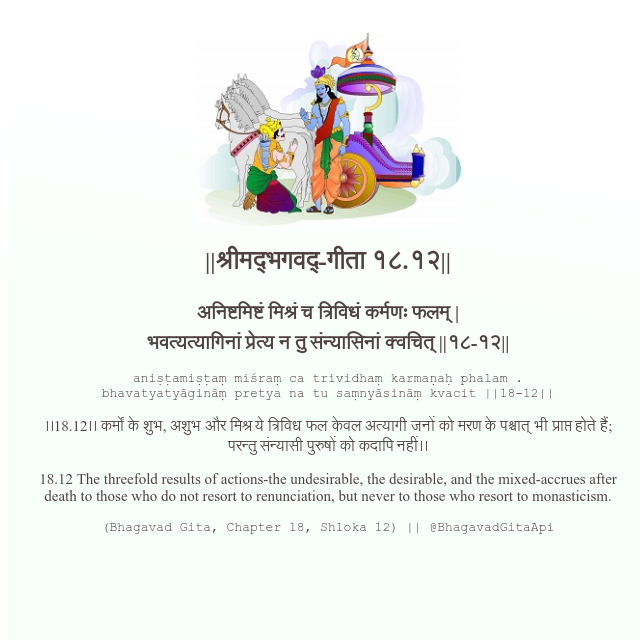

<h2>||श्रीमद्‍भगवद्‍-गीता १८.१२||</h2>
<h3>अनिष्टमिष्टं मिश्रं च त्रिविधं कर्मणः फलम् | भवत्यत्यागिनां प्रेत्य न तु संन्यासिनां क्वचित् ||१८-१२||</h3>
<pre>aniṣṭamiṣṭaṃ miśraṃ ca trividhaṃ karmaṇaḥ phalam . bhavatyatyāgināṃ pretya na tu saṃnyāsināṃ kvacit ||18-12||</pre>

।।18.12।। कर्मों के शुभ, अशुभ और मिश्र ये त्रिविध फल केवल अत्यागी जनों को मरण के पश्चात् भी प्राप्त होते हैं; परन्तु संन्यासी पुरुषों को कदापि नहीं।।

<pre>(Bhagavad Gita, Chapter 18, Shloka 12) || @BhagavadGitaApi</pre>
https://bhagavadgitaapi.in/

#API #bhagavadgitaapi #slok #nodejs #js #api #gitaapi #krishna #hinduism #vedic #ISKCON #shreemadbhagavadgita #technology

