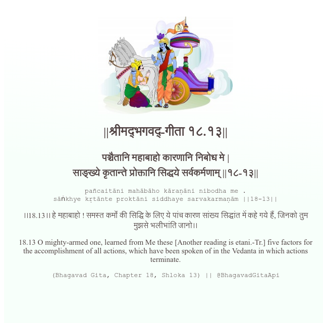

<h2>||श्रीमद्‍भगवद्‍-गीता १८.१३||</h2>
<h3>पञ्चैतानि महाबाहो कारणानि निबोध मे | साङ्ख्ये कृतान्ते प्रोक्तानि सिद्धये सर्वकर्मणाम् ||१८-१३||</h3>
<pre>pañcaitāni mahābāho kāraṇāni nibodha me . sāṅkhye kṛtānte proktāni siddhaye sarvakarmaṇām ||18-13||</pre>

।।18.13।। हे महाबाहो ! समस्त कर्मों की सिद्धि के लिए ये पांच कारण सांख्य सिद्धांत में कहे गये हैं, जिनको तुम मुझसे भलीभांति जानो।।

<pre>(Bhagavad Gita, Chapter 18, Shloka 13) || @BhagavadGitaApi</pre>
https://docs.bhagavadgitaapi.in/

#API #bhagavadgitaapi #slok #nodejs #js #api #gitaapi #krishna #hinduism #vedic #ISKCON #shreemadbhagavadgita #technology

