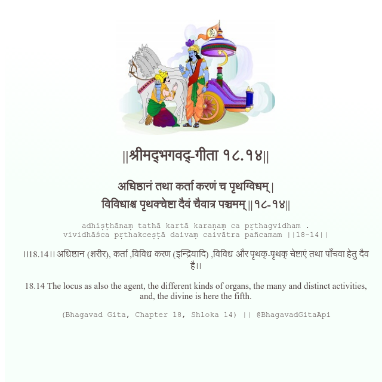

<h2>||श्रीमद्‍भगवद्‍-गीता १८.१४||</h2>
<h3>अधिष्ठानं तथा कर्ता करणं च पृथग्विधम् | विविधाश्च पृथक्चेष्टा दैवं चैवात्र पञ्चमम् ||१८-१४||</h3>
<pre>adhiṣṭhānaṃ tathā kartā karaṇaṃ ca pṛthagvidham . vividhāśca pṛthakceṣṭā daivaṃ caivātra pañcamam ||18-14||</pre>

।।18.14।। अधिष्ठान (शरीर), कर्ता ,विविध करण (इन्द्रियादि) ,विविध और पृथक्-पृथक् चेष्टाएं तथा पाँचवा हेतु दैव है।।

<pre>(Bhagavad Gita, Chapter 18, Shloka 14) || @BhagavadGitaApi</pre>
https://bhagavadgitaapi.in/

#API #bhagavadgitaapi #slok #nodejs #js #api #gitaapi #krishna #hinduism #vedic #ISKCON #shreemadbhagavadgita #technology

