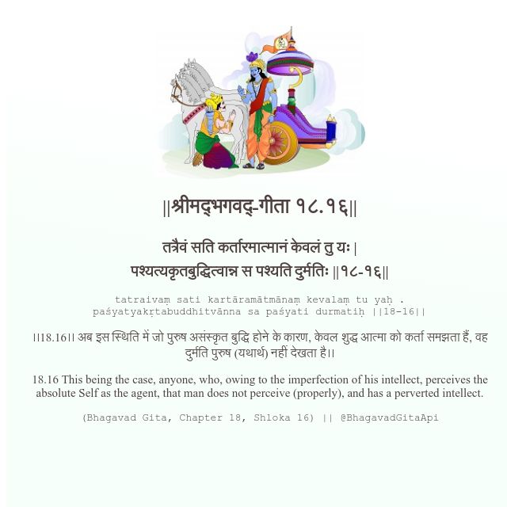

<h2>||श्रीमद्‍भगवद्‍-गीता १८.१६||</h2>
<h3>तत्रैवं सति कर्तारमात्मानं केवलं तु यः | पश्यत्यकृतबुद्धित्वान्न स पश्यति दुर्मतिः ||१८-१६||</h3>
<pre>tatraivaṃ sati kartāramātmānaṃ kevalaṃ tu yaḥ . paśyatyakṛtabuddhitvānna sa paśyati durmatiḥ ||18-16||</pre>

।।18.16।। अब इस स्थिति में जो पुरुष असंस्कृत बुद्धि होने के कारण, केवल शुद्ध आत्मा को कर्ता समझता हैं, वह दुर्मति पुरुष (यथार्थ) नहीं देखता है।।

<pre>(Bhagavad Gita, Chapter 18, Shloka 16) || @BhagavadGitaApi</pre>
https://docs.bhagavadgitaapi.in/

#API #bhagavadgitaapi #slok #nodejs #js #api #gitaapi #krishna #hinduism #vedic #ISKCON #shreemadbhagavadgita #technology

