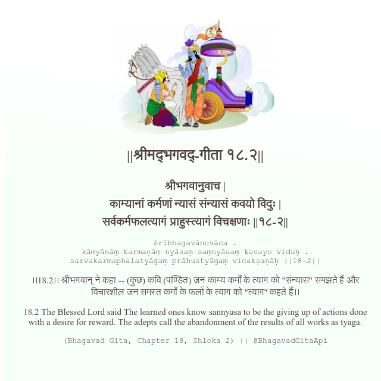

<h2>||श्रीमद्‍भगवद्‍-गीता १८.२||</h2>
<h3>श्रीभगवानुवाच | काम्यानां कर्मणां न्यासं संन्यासं कवयो विदुः | सर्वकर्मफलत्यागं प्राहुस्त्यागं विचक्षणाः ||१८-२||</h3>
<pre>śrībhagavānuvāca . kāmyānāṃ karmaṇāṃ nyāsaṃ saṃnyāsaṃ kavayo viduḥ . sarvakarmaphalatyāgaṃ prāhustyāgaṃ vicakṣaṇāḥ ||18-2||</pre>

।।18.2।। श्रीभगवान् ने कहा -- (कुछ) कवि (पण्डित) जन काम्य कर्मों के त्याग को "संन्यास" समझते हैं और विचारशील जन समस्त कर्मों के फलों के त्याग को "त्याग" कहते हैं।।

<pre>(Bhagavad Gita, Chapter 18, Shloka 2) || @BhagavadGitaApi</pre>
https://bhagavadgitaapi.in/

#API #bhagavadgitaapi #slok #nodejs #js #api #gitaapi #krishna #hinduism #vedic #ISKCON #shreemadbhagavadgita #technology

