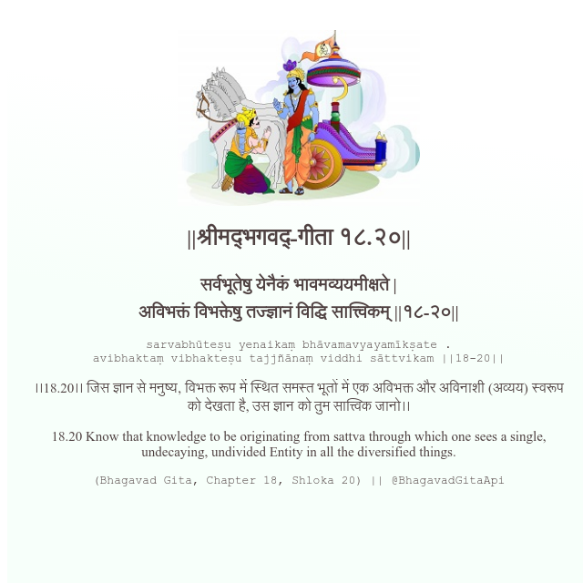

<h2>||श्रीमद्‍भगवद्‍-गीता १८.२०||</h2>
<h3>सर्वभूतेषु येनैकं भावमव्ययमीक्षते | अविभक्तं विभक्तेषु तज्ज्ञानं विद्धि सात्त्विकम् ||१८-२०||</h3>
<pre>sarvabhūteṣu yenaikaṃ bhāvamavyayamīkṣate . avibhaktaṃ vibhakteṣu tajjñānaṃ viddhi sāttvikam ||18-20||</pre>

।।18.20।। जिस ज्ञान से मनुष्य, विभक्त रूप में स्थित समस्त भूतों में एक अविभक्त और अविनाशी (अव्यय) स्वरूप को देखता है, उस ज्ञान को तुम सात्त्विक जानो।।

<pre>(Bhagavad Gita, Chapter 18, Shloka 20) || @BhagavadGitaApi</pre>
https://vedicscriptures.github.io/

#API #bhagavadgitaapi #slok #nodejs #js #api #gitaapi #krishna #hinduism #vedic #ISKCON #shreemadbhagavadgita #technology

