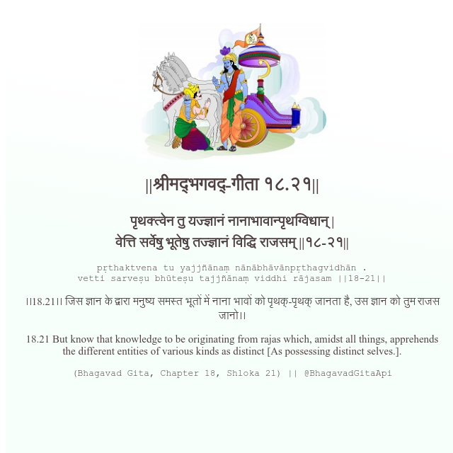

<h2>||श्रीमद्‍भगवद्‍-गीता १८.२१||</h2>
<h3>पृथक्त्वेन तु यज्ज्ञानं नानाभावान्पृथग्विधान् | वेत्ति सर्वेषु भूतेषु तज्ज्ञानं विद्धि राजसम् ||१८-२१||</h3>
<pre>pṛthaktvena tu yajjñānaṃ nānābhāvānpṛthagvidhān . vetti sarveṣu bhūteṣu tajjñānaṃ viddhi rājasam ||18-21||</pre>

।।18.21।। जिस ज्ञान के द्वारा मनुष्य समस्त भूतों में नाना भावों को पृथक्-पृथक् जानता है, उस ज्ञान को तुम राजस जानो।।

<pre>(Bhagavad Gita, Chapter 18, Shloka 21) || @BhagavadGitaApi</pre>
https://vedicscriptures.github.io/

#API #bhagavadgitaapi #slok #nodejs #js #api #gitaapi #krishna #hinduism #vedic #ISKCON #shreemadbhagavadgita #technology

