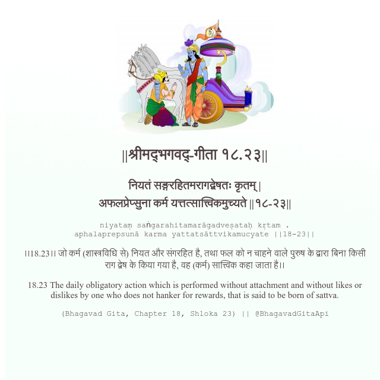

<h2>||श्रीमद्‍भगवद्‍-गीता १८.२३||</h2>
<h3>नियतं सङ्गरहितमरागद्वेषतः कृतम् | अफलप्रेप्सुना कर्म यत्तत्सात्त्विकमुच्यते ||१८-२३||</h3>
<pre>niyataṃ saṅgarahitamarāgadveṣataḥ kṛtam . aphalaprepsunā karma yattatsāttvikamucyate ||18-23||</pre>

।।18.23।। जो कर्म (शास्त्रविधि से) नियत और संगरहित है, तथा फल को न चाहने वाले पुरुष के द्वारा बिना किसी राग द्वेष के किया गया है, वह (कर्म) सात्त्विक कहा जाता है।।

<pre>(Bhagavad Gita, Chapter 18, Shloka 23) || @BhagavadGitaApi</pre>
https://vedicscriptures.github.io/

#API #bhagavadgitaapi #slok #nodejs #js #api #gitaapi #krishna #hinduism #vedic #ISKCON #shreemadbhagavadgita #technology

