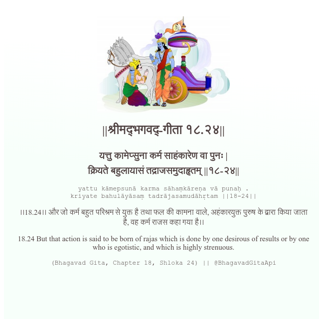

<h2>||श्रीमद्‍भगवद्‍-गीता १८.२४||</h2>
<h3>यत्तु कामेप्सुना कर्म साहंकारेण वा पुनः | क्रियते बहुलायासं तद्राजसमुदाहृतम् ||१८-२४||</h3>
<pre>yattu kāmepsunā karma sāhaṃkāreṇa vā punaḥ . kriyate bahulāyāsaṃ tadrājasamudāhṛtam ||18-24||</pre>

।।18.24।। और जो कर्म बहुत परिश्रम से युक्त है तथा फल की कामना वाले, अहंकारयुक्त पुरुष के द्वारा किया जाता है, वह कर्म राजस कहा गया है।।

<pre>(Bhagavad Gita, Chapter 18, Shloka 24) || @BhagavadGitaApi</pre>
https://bhagavadgitaapi.in/

#API #bhagavadgitaapi #slok #nodejs #js #api #gitaapi #krishna #hinduism #vedic #ISKCON #shreemadbhagavadgita #technology

