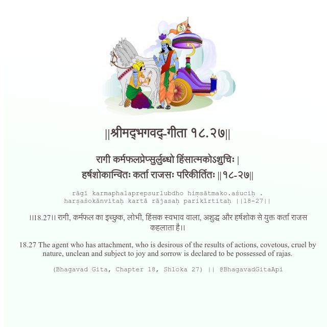

<h2>||श्रीमद्‍भगवद्‍-गीता १८.२७||</h2>
<h3>रागी कर्मफलप्रेप्सुर्लुब्धो हिंसात्मकोऽशुचिः | हर्षशोकान्वितः कर्ता राजसः परिकीर्तितः ||१८-२७||</h3>
<pre>rāgī karmaphalaprepsurlubdho hiṃsātmako.aśuciḥ . harṣaśokānvitaḥ kartā rājasaḥ parikīrtitaḥ ||18-27||</pre>

।।18.27।। रागी, कर्मफल का इच्छुक, लोभी, हिंसक स्वभाव वाला, अशुद्ध और हर्षशोक से युक्त कर्ता राजस कहलाता है।।

<pre>(Bhagavad Gita, Chapter 18, Shloka 27) || @BhagavadGitaApi</pre>
https://bhagavadgitaapi.in/

#API #bhagavadgitaapi #slok #nodejs #js #api #gitaapi #krishna #hinduism #vedic #ISKCON #shreemadbhagavadgita #technology

