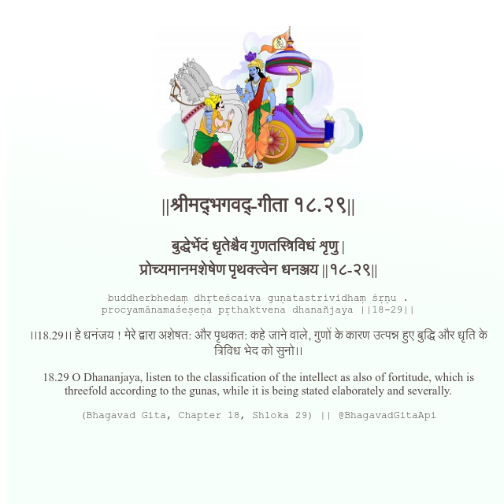

<h2>||श्रीमद्‍भगवद्‍-गीता १८.२९||</h2>
<h3>बुद्धेर्भेदं धृतेश्चैव गुणतस्त्रिविधं शृणु | प्रोच्यमानमशेषेण पृथक्त्वेन धनञ्जय ||१८-२९||</h3>
<pre>buddherbhedaṃ dhṛteścaiva guṇatastrividhaṃ śṛṇu . procyamānamaśeṣeṇa pṛthaktvena dhanañjaya ||18-29||</pre>

।।18.29।। हे धनंजय ! मेरे द्वारा अशेषत: और पृथकत: कहे जाने वाले, गुणों के कारण उत्पन्न हुए बुद्धि और धृति के त्रिविध भेद को सुनो।।

<pre>(Bhagavad Gita, Chapter 18, Shloka 29) || @BhagavadGitaApi</pre>
https://vedicscriptures.github.io/

#API #bhagavadgitaapi #slok #nodejs #js #api #gitaapi #krishna #hinduism #vedic #ISKCON #shreemadbhagavadgita #technology

