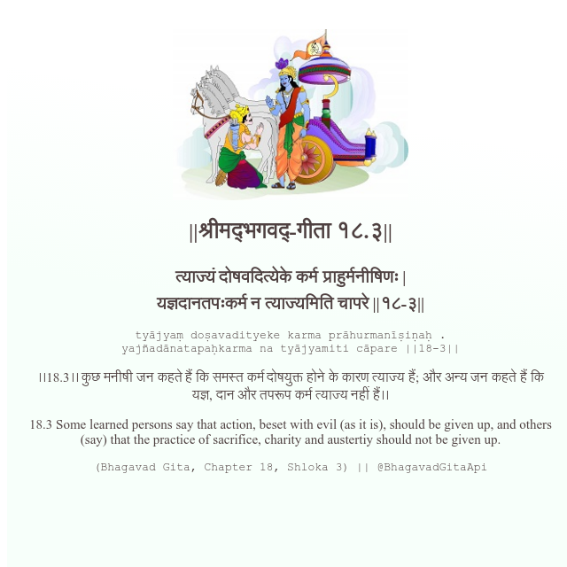

<h2>||श्रीमद्‍भगवद्‍-गीता १८.३||</h2>
<h3>त्याज्यं दोषवदित्येके कर्म प्राहुर्मनीषिणः | यज्ञदानतपःकर्म न त्याज्यमिति चापरे ||१८-३||</h3>
<pre>tyājyaṃ doṣavadityeke karma prāhurmanīṣiṇaḥ . yajñadānatapaḥkarma na tyājyamiti cāpare ||18-3||</pre>

।।18.3।। कुछ मनीषी जन कहते हैं कि समस्त कर्म दोषयुक्त होने के कारण त्याज्य हैं; और अन्य जन कहते हैं कि यज्ञ, दान और तपरूप कर्म त्याज्य नहीं हैं।।

<pre>(Bhagavad Gita, Chapter 18, Shloka 3) || @BhagavadGitaApi</pre>
https://docs.bhagavadgitaapi.in/

#API #bhagavadgitaapi #slok #nodejs #js #api #gitaapi #krishna #hinduism #vedic #ISKCON #shreemadbhagavadgita #technology

