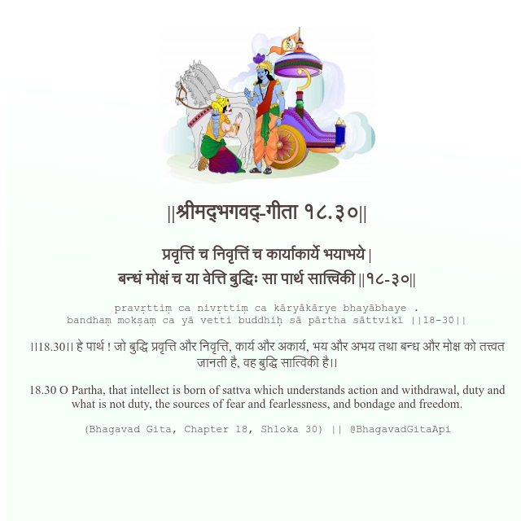

<h2>||श्रीमद्‍भगवद्‍-गीता १८.३०||</h2>
<h3>प्रवृत्तिं च निवृत्तिं च कार्याकार्ये भयाभये | बन्धं मोक्षं च या वेत्ति बुद्धिः सा पार्थ सात्त्विकी ||१८-३०||</h3>
<pre>pravṛttiṃ ca nivṛttiṃ ca kāryākārye bhayābhaye . bandhaṃ mokṣaṃ ca yā vetti buddhiḥ sā pārtha sāttvikī ||18-30||</pre>

।।18.30।। हे पार्थ ! जो बुद्धि प्रवृत्ति और निवृत्ति, कार्य और अकार्य, भय और अभय तथा बन्ध और मोक्ष को तत्त्वत जानती है, वह बुद्धि सात्विकी है।।

<pre>(Bhagavad Gita, Chapter 18, Shloka 30) || @BhagavadGitaApi</pre>
https://docs.bhagavadgitaapi.in/

#API #bhagavadgitaapi #slok #nodejs #js #api #gitaapi #krishna #hinduism #vedic #ISKCON #shreemadbhagavadgita #technology

