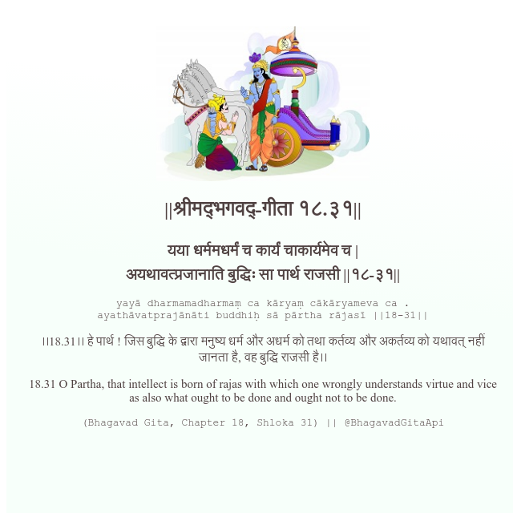

<h2>||श्रीमद्‍भगवद्‍-गीता १८.३१||</h2>
<h3>यया धर्ममधर्मं च कार्यं चाकार्यमेव च | अयथावत्प्रजानाति बुद्धिः सा पार्थ राजसी ||१८-३१||</h3>
<pre>yayā dharmamadharmaṃ ca kāryaṃ cākāryameva ca . ayathāvatprajānāti buddhiḥ sā pārtha rājasī ||18-31||</pre>

।।18.31।। हे पार्थ ! जिस बुद्धि के द्वारा मनुष्य धर्म और अधर्म को तथा कर्तव्य और अकर्तव्य को यथावत् नहीं जानता है, वह बुद्धि राजसी है।।

<pre>(Bhagavad Gita, Chapter 18, Shloka 31) || @BhagavadGitaApi</pre>
https://bhagavadgitaapi.in/

#API #bhagavadgitaapi #slok #nodejs #js #api #gitaapi #krishna #hinduism #vedic #ISKCON #shreemadbhagavadgita #technology

