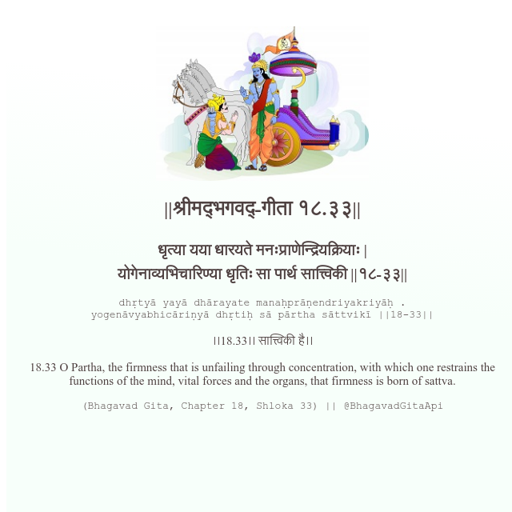

<h2>||श्रीमद्‍भगवद्‍-गीता १८.३३||</h2>
<h3>धृत्या यया धारयते मनःप्राणेन्द्रियक्रियाः | योगेनाव्यभिचारिण्या धृतिः सा पार्थ सात्त्विकी ||१८-३३||</h3>
<pre>dhṛtyā yayā dhārayate manaḥprāṇendriyakriyāḥ . yogenāvyabhicāriṇyā dhṛtiḥ sā pārtha sāttvikī ||18-33||</pre>

।।18.33।। सात्त्विकी है।।

<pre>(Bhagavad Gita, Chapter 18, Shloka 33) || @BhagavadGitaApi</pre>
https://vedicscriptures.github.io/

#API #bhagavadgitaapi #slok #nodejs #js #api #gitaapi #krishna #hinduism #vedic #ISKCON #shreemadbhagavadgita #technology

