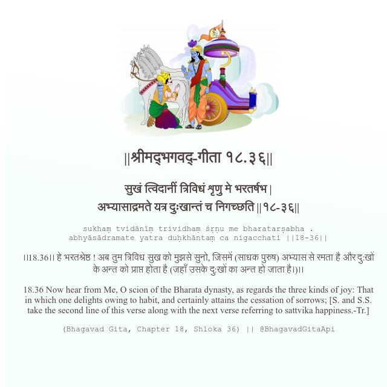

<h2>||श्रीमद्‍भगवद्‍-गीता १८.३६||</h2>
<h3>सुखं त्विदानीं त्रिविधं शृणु मे भरतर्षभ | अभ्यासाद्रमते यत्र दुःखान्तं च निगच्छति ||१८-३६||</h3>
<pre>sukhaṃ tvidānīṃ trividhaṃ śṛṇu me bharatarṣabha . abhyāsādramate yatra duḥkhāntaṃ ca nigacchati ||18-36||</pre>

।।18.36।। हे भरतश्रेष्ठ ! अब तुम त्रिविध सुख को मुझसे सुनो, जिसमें (साधक पुरुष) अभ्यास से रमता है और दु:खों के अन्त को प्राप्त होता है (जहाँ उसके दु:खों का अन्त हो जाता है।)।।

<pre>(Bhagavad Gita, Chapter 18, Shloka 36) || @BhagavadGitaApi</pre>
https://vedicscriptures.github.io/

#API #bhagavadgitaapi #slok #nodejs #js #api #gitaapi #krishna #hinduism #vedic #ISKCON #shreemadbhagavadgita #technology

