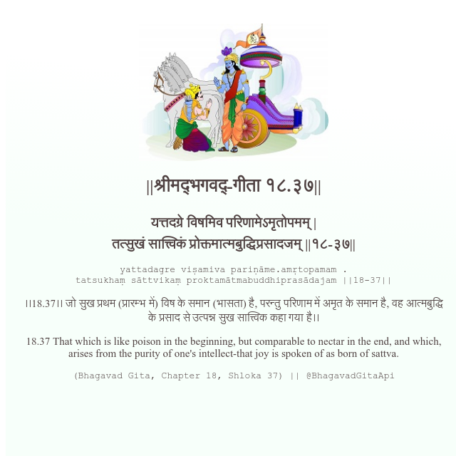

<h2>||श्रीमद्‍भगवद्‍-गीता १८.३७||</h2>
<h3>यत्तदग्रे विषमिव परिणामेऽमृतोपमम् | तत्सुखं सात्त्विकं प्रोक्तमात्मबुद्धिप्रसादजम् ||१८-३७||</h3>
<pre>yattadagre viṣamiva pariṇāme.amṛtopamam . tatsukhaṃ sāttvikaṃ proktamātmabuddhiprasādajam ||18-37||</pre>

।।18.37।। जो सुख प्रथम (प्रारम्भ में) विष के समान (भासता) है, परन्तु परिणाम में अमृत के समान है, वह आत्मबुद्धि के प्रसाद से उत्पन्न सुख सात्त्विक कहा गया है।।

<pre>(Bhagavad Gita, Chapter 18, Shloka 37) || @BhagavadGitaApi</pre>
https://vedicscriptures.github.io/

#API #bhagavadgitaapi #slok #nodejs #js #api #gitaapi #krishna #hinduism #vedic #ISKCON #shreemadbhagavadgita #technology

