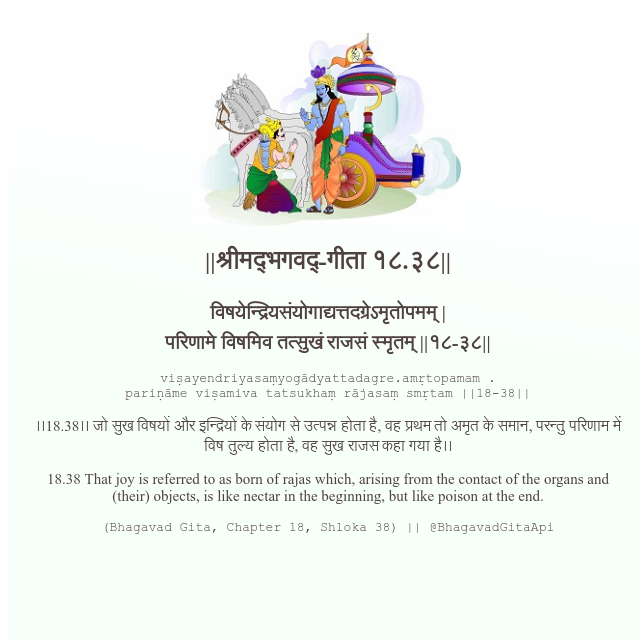

<h2>||श्रीमद्‍भगवद्‍-गीता १८.३८||</h2>
<h3>विषयेन्द्रियसंयोगाद्यत्तदग्रेऽमृतोपमम् | परिणामे विषमिव तत्सुखं राजसं स्मृतम् ||१८-३८||</h3>
<pre>viṣayendriyasaṃyogādyattadagre.amṛtopamam . pariṇāme viṣamiva tatsukhaṃ rājasaṃ smṛtam ||18-38||</pre>

।।18.38।। जो सुख विषयों और इन्द्रियों के संयोग से उत्पन्न होता है, वह प्रथम तो अमृत के समान, परन्तु परिणाम में विष तुल्य होता है, वह सुख राजस कहा गया है।।

<pre>(Bhagavad Gita, Chapter 18, Shloka 38) || @BhagavadGitaApi</pre>
https://docs.bhagavadgitaapi.in/

#API #bhagavadgitaapi #slok #nodejs #js #api #gitaapi #krishna #hinduism #vedic #ISKCON #shreemadbhagavadgita #technology

