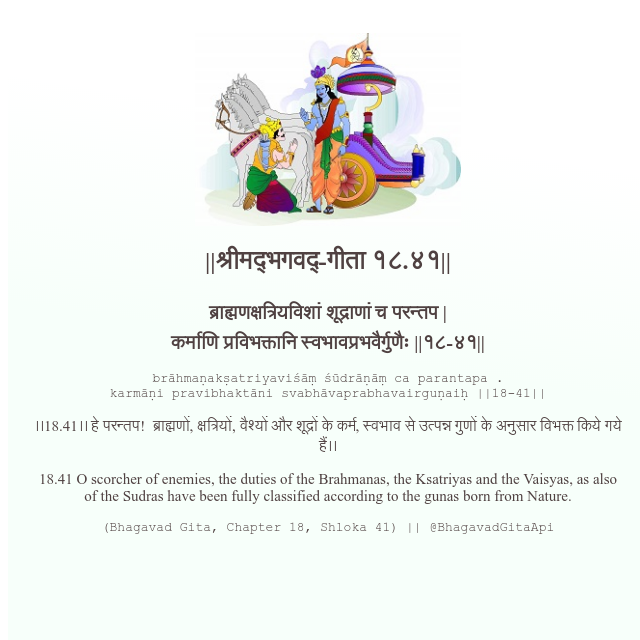

<h2>||श्रीमद्‍भगवद्‍-गीता १८.४१||</h2>
<h3>ब्राह्मणक्षत्रियविशां शूद्राणां च परन्तप | कर्माणि प्रविभक्तानि स्वभावप्रभवैर्गुणैः ||१८-४१||</h3>
<pre>brāhmaṇakṣatriyaviśāṃ śūdrāṇāṃ ca parantapa . karmāṇi pravibhaktāni svabhāvaprabhavairguṇaiḥ ||18-41||</pre>

।।18.41।। हे परन्तप!  ब्राह्मणों, क्षत्रियों, वैश्यों और शूद्रों के कर्म, स्वभाव से उत्पन्न गुणों के अनुसार विभक्त किये गये हैं।।

<pre>(Bhagavad Gita, Chapter 18, Shloka 41) || @BhagavadGitaApi</pre>
https://bhagavadgitaapi.in/

#API #bhagavadgitaapi #slok #nodejs #js #api #gitaapi #krishna #hinduism #vedic #ISKCON #shreemadbhagavadgita #technology

