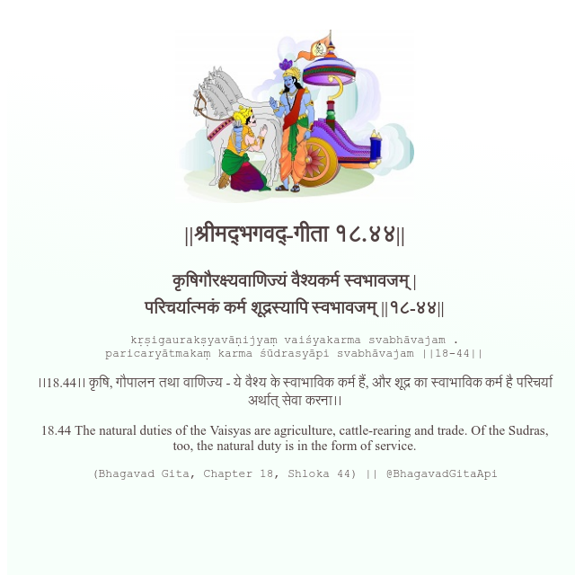

<h2>||श्रीमद्‍भगवद्‍-गीता १८.४४||</h2>
<h3>कृषिगौरक्ष्यवाणिज्यं वैश्यकर्म स्वभावजम् | परिचर्यात्मकं कर्म शूद्रस्यापि स्वभावजम् ||१८-४४||</h3>
<pre>kṛṣigaurakṣyavāṇijyaṃ vaiśyakarma svabhāvajam . paricaryātmakaṃ karma śūdrasyāpi svabhāvajam ||18-44||</pre>

।।18.44।। कृषि, गौपालन तथा वाणिज्य - ये वैश्य के स्वाभाविक कर्म हैं, और शूद्र का स्वाभाविक कर्म है परिचर्या अर्थात् सेवा करना।।

<pre>(Bhagavad Gita, Chapter 18, Shloka 44) || @BhagavadGitaApi</pre>
https://docs.bhagavadgitaapi.in/

#API #bhagavadgitaapi #slok #nodejs #js #api #gitaapi #krishna #hinduism #vedic #ISKCON #shreemadbhagavadgita #technology

