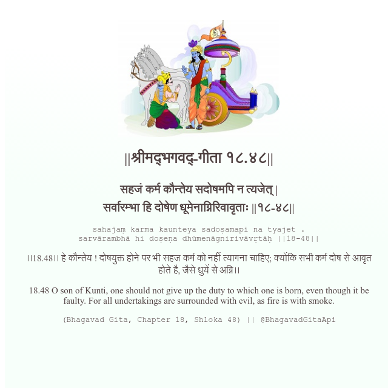

<h2>||श्रीमद्‍भगवद्‍-गीता १८.४८||</h2>
<h3>सहजं कर्म कौन्तेय सदोषमपि न त्यजेत् | सर्वारम्भा हि दोषेण धूमेनाग्निरिवावृताः ||१८-४८||</h3>
<pre>sahajaṃ karma kaunteya sadoṣamapi na tyajet . sarvārambhā hi doṣeṇa dhūmenāgnirivāvṛtāḥ ||18-48||</pre>

।।18.48।। हे कौन्तेय ! दोषयुक्त होने पर भी सहज कर्म को नहीं त्यागना चाहिए; क्योंकि सभी कर्म दोष से आवृत होते है, जैसे धुयें से अग्नि।।

<pre>(Bhagavad Gita, Chapter 18, Shloka 48) || @BhagavadGitaApi</pre>
https://bhagavadgitaapi.in/

#API #bhagavadgitaapi #slok #nodejs #js #api #gitaapi #krishna #hinduism #vedic #ISKCON #shreemadbhagavadgita #technology

